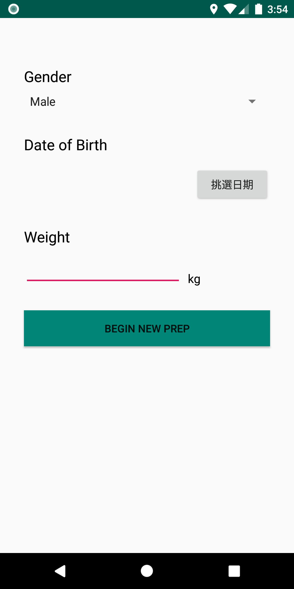
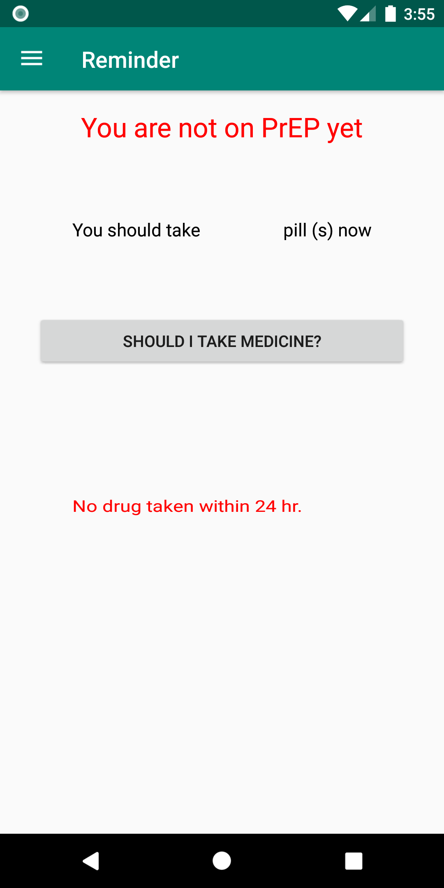
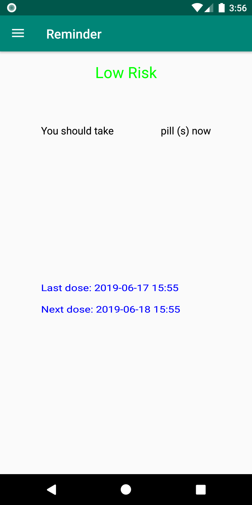
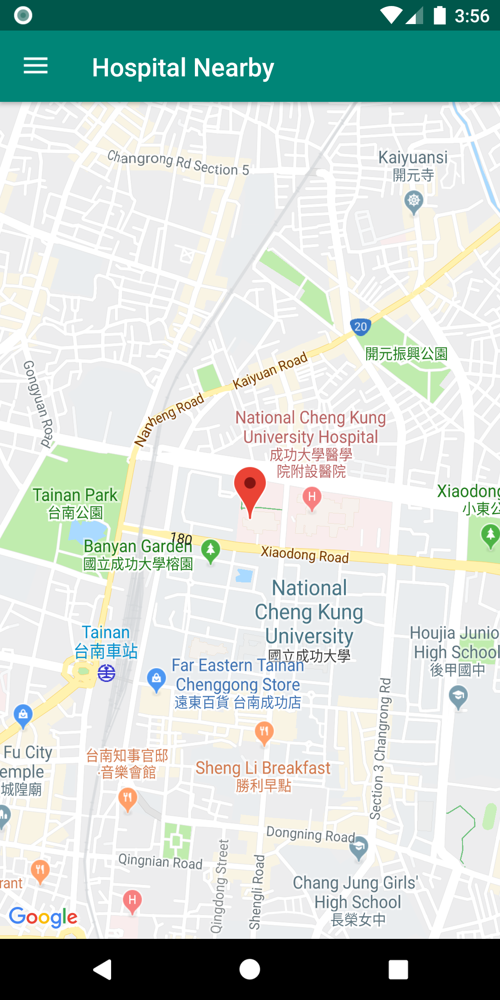

# HealthKeeper
#### list of tools, libraries, platform, etc. used in the project
```
* ConstraintLayout
* Scrolling View
* Fragmnet
* Navigation Drawer
* DateTime Picker
* Broadcast
* Notification
* SQLite
* SharedPreference
* PendingIntent
```

#### contributions of each team member
```
* Hank 100%
* Yiyi 100%
```

#### demo video link

#### screenshots




