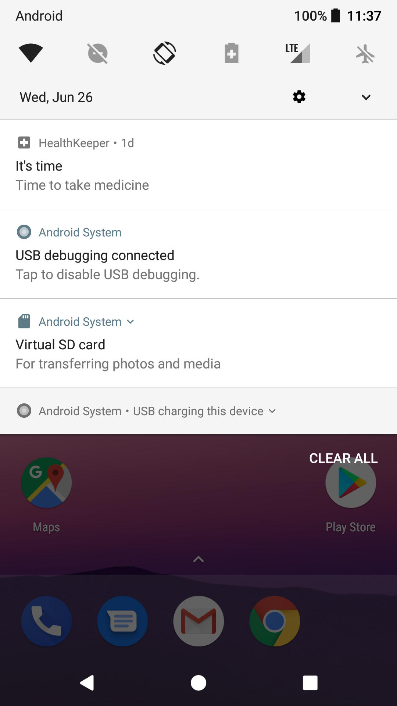

# HealthKeeper

https://play.google.com/store/apps/details?id=tw.edu.bmilab.healthkeeper

#### list of tools, libraries, platform, etc. used in the project
```
* ConstraintLayout
* Scrolling View
* Fragmnet
* Navigation Drawer
* DateTime Picker
* Broadcast
* Notification
* SQLite
* SharedPreference
* PendingIntent
```

#### screenshots



